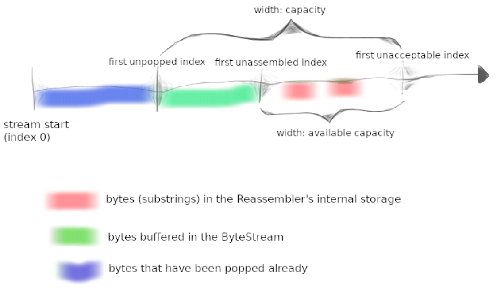

Checkpoint 1 Writeup
====================

# 回顾
实验任务将要求您以模块化的方式构建 TCP 实现。还记得您在 Checkpoint 0 中刚刚实现的ByteStream吗？在接下来的实验中，您将在网络上传送两个ByteStream：一个“出站”ByteStream，用于本地应用程序写入套接字并由您的TCP发送到对等方，以及一个“入站”ByteStream，用于从对等方接收的数据，将由本地应用程序读取。

Checkpoint 0 实现了 ByteStream 这是一个内存中的字节流 "管道"。本实验将实现 TCP 接收器 Reassembler。 该模块接收数据，将其转换为可靠的字节流并写入 ByteStream，以供应用程序读取使用。

# 准备开始

## Checkpoint 0 测试
```git
cmake -S . -B build
cd build/
cmake ..
make check1
```

## Checkpoint 1 获取

```git
git fetch --all
git merge origin/check1-startercode
cmake -S . -B build
cmake --build build
```

# 将子串按序排列

在这个实验和下一个实验中，您将实现一个 TCP 接收器：这个模块接收数据报并将其转换为可靠的字节流，以便应用程序从套接字读取。就像您在 Checkpoint 0 中的 webget 程序从 web 服务器读取字节流一样。

TCP发送器将字节流分成短的片段（每个片段不超过约1460字节），以便它们每个都适应一个数据报中。但是网络可能会重新排序这些数据报，或者丢弃它们，或者传递它们多次。接收器必须将这些片段重新组装成最初的连续字节流。

在这个实验中，您将编写负责这种重组的数据结构：一个 Reassembler。它将接收由一串字节和该字符串在较大流中的第一个字节的索引组成的子字符串。流中的每个字节都有自己独特的索引，从零开始逐渐增加。

接口如下：
``` cpp
// Insert a new substring to be reassembled into a ByteStream.
void insert( uint64_t first_index, std::string data, 
    bool is_last_substring, Writer& output );
```

```cpp
// How many bytes are stored in the Reassembler itself?
uint64_t bytes_pending() const;
```

重组器的完整（公共）接口由 reassembler.hh 标头中的 Reassembler 类描述。你的任务是实现这个类。您可以向 Reassembler 类添加所需的任何私有成员和成员函数，但不能更改其公共接口。

## Reassembler 应该在内部存储什么？
insert 方法通知 Reassembler 有关 ByteStream 的新片段，以及它在整个流中的位置（子字符串开头的索引）。流的每个字节都有自己唯一的索引，从零开始向上计数。

原则上，重组器必须处理三类内容：
- 子字符串可能以任何顺序到达，因此，必须 缓存 接收到的子字符串，直到他们之前的索引都已写入。
- 下一个需要重新组装的子串的索引，一旦接收到该子串，立刻写入 ByteStream。
- 提前到达的子串，当容量足够时就缓存，等前面的子串到达在写入。容量不够，直接丢弃。

即：

1. 流中的下一字节。一旦知道他们，Reasembler 就应该将他们压入 Writer。
2. 提前到达的字节。如果流的容量可用，这些需要存储在存储器中，以等待先前的字节到达。
3. 超出流容量的字节，应该被丢弃。

这种行为的目标是限制 Reassembler 和 ByteStream 使用的内存量，无论输入的子字符串如何到达。我们在下面的图片中对此进行了说明。"容量"是对两者的上限：

1. 重组后的 ByteStream 中缓冲的字节数（以绿色显示），
2. “未重组”子字符串可以使用的字节数（以红色显示）



当您实现Reassembler并进行测试时，您可能会发现这张图片很有用——有时候正确的行为并不总是自然而然的。

# 测试
```
cmake --build build --target check1
```

