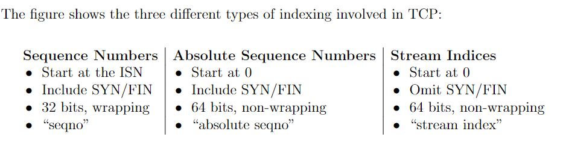

Checkpoint 2 Writeup: the TCP receiver
====================

# 回顾
checkpoint 0, 实现了流控制字节流的抽象 ByteStream。
Checkpoint 1, 创建了一个 Reassembler, 它接收一系列的子串，所有的子串均来自同一字节流，并将它们重新组装回原始流。

这些模块为 TCP 的实现有用。本实验将实现 TCPReceiver, 它是 TCP 实现中处理传入字节流部分。

TCPReceiver 接收来自对等方发送的消息 (通过 receive() 方法), 并将它们转换为对 Reassembler 重组器的调用，重组器最终写入传入的字节流 ByteStream。
应用程序从 ByteStream 中读取数据，就如 Lab0 中使用 TCPSocket 读取数据一样。

同时， TCPReceiver 还通过 send() 方法生成返回给对等发送方的消息。这些消息告诉发送方：
    1. "第一个未组装" 字节的索引，称为 "确认号" 或 "ackno"。这是接收方需要从发送方获得的第一个字节。
    2. ByteStream 的可用容量。也可以称为 "窗口大小"。

ackno 和 窗口大小一起描述了接收方的窗口：允许 TCP 发送方发送的索引范围。使用该窗口，接收方可以控制传入的数据流，使发送方限制其发送的数据量，
直到接收方准备好接收更多的数据。有时将 ackno 称为窗口的 "左边界"（TCPReceiver感兴趣的最小索引），将 ackno + 窗口大小 称为 "有边界"(刚好超出 TCPReceiver 感兴趣的最大索引)。

# 准备开始
## Checkpoint 1 测试
```git
cmake -S . -B build
cd build/
cmake ..
make check1
```

## Checkpoint 2 获取

```git
git fetch --all
git merge origin/check2-startercode
cmake -S . -B build
cmake --build build
```

# The TCP Receiver
TCP 是一种通过不可靠的数据报可靠地传送一对流量控制字节流（每个方向一个）的协议。两方或“对等点”参与 TCP 连接，每个对等点同时充当“发送者”（其自己的传出字节流）和“接收者”（传入字节流）。

本周实现 TCP 的 "接收方" 部分，负责从发送方接收消息，重新组装字节流，并确定应回应发送方的消息确认和流量控制

在 TCP 中， 确认意味着"接收方需要的下一个字节的索引是什么，以便它可以重新组装更多的字节流"。这告诉发送方需要发送哪些字节。
流量控制意味着 "接收方感兴趣并愿意接收什么范围的索引"。这告诉发送方它被允许发送多少数据流。

## 在 64 位索引和 32 位序列号之间转换
作为热身，需要实现TCP 表示索引的方式。上周创建了一个重组器，用于重新组装子串。其中每个字节都有一个 64 位流索引，流中的第一个字节索引始终为 0。
64 位索引足够大，可以将其视为永远不会溢出。然而，在 TCP 头中，空间非常宝贵，流中的每个字节的索引不是用 64 位索引表示，而是32位的序列号 "seqno"表示。这带来了 3 个问题：
 1. TCP 中的流可以任意长——通过TCP发送的字节流没有限制。32 位整数仅能表示 4G 的索引，一旦 32 位序列号计数达到 2^32 - 1，流中的下一个字节的序列号将为 0.
    
 2. TCP 序列号从随机值开始。为了提高鲁棒性并避免被属于同一端点之间的早期连接的旧段混淆，TCP 试图确保序列号不被猜出来，也不太可能重复。因此，流中的第一个字节的序列号是一个随机的 32 位数字， 称为 初始序列号（ISN，initial sequence number）。这代表 "zero point" 或者 SYN (beginning  of stream)。此后的其余序列号表现正常：数据的第一个字节将具有 ISN + 1 (mod 2^32) 的序列号， 第二个字节将具有 ISN + 2 (mod 2^32), ....
    
 3. 逻辑开始和结束各占一个序列号。除了确保接收到所有字节的数据外，TCP 还可靠地接收到流的开始和结束。因此，在 TCP 中，SYN (beginning-of-stream) 和 FIN (end-of-stream) 控制标记被分配了序列号。其中，每一个都占用一个序列号。(SYN 占用的序号就是 ISN). 流中数据的每个字节也占用一个序列号。但是，SYN 和 FIN 不是流本身的一部分，也不是 "字节"——它们代表流本身的开始和结束。

这些序列号(seqnos, sequence numbers)在每个 TCP 段的标头被传输。（同样，有两个流，每个方向各一个。每个流都有单独的序列号和不同的随机 ISN）。
有时谈论“绝对序列号”（始终从零开始）的概念也很有帮助。并且不换行），以及“流索引”（您已经在重组器中使用的内容：流中每个字节的索引，从零开始）。

例子：假设 SYN 碰巧为 2^32 - 2  

|   element   |  SYN   | c      | a | t | FIN | 
| -             | -      | -      | - | - | -   |
|  seqno        |2^32 - 2|2^32 - 1|  0| 1 |  2  |    
|absolute seqno | 0      |   1    | 2 | 3 |  4  |  
|stream index   |        |   0    | 1 | 2 |     |



绝对序列号和流索引之间的转换非常简单——只需 加 1 或者减 1. 但是，序列号和绝对序列号之间的转换有点困难，混淆两者将产生棘手的 bugs。
为了系统地防止这些 bugs, 将自定义类型 Wrap32 来表示 序列号，并编写它与 绝对序列号 (用 uint64_t表示) 之间的转换。

在 wrapping_integers.cc 中完成转换函数的编写。
 1. 转换函数 wrap: absolute seqno -> seqno. 给定绝对序列号(n)和初始序列号 ISN (zero_point)，生成 n（相对）序列号。
 2. 转换函数 unwrap: seqno -> absolute seqno. 给定一个序列号（Wrap32）、初始序列号 ISN（ zero_point ）和绝对检查点序列号，找到最接近检查点 checkpoint 的相应绝对序列号。

注意：需要检查点 checkpoint，是因为任何给定的 seqno 都对应于许多绝对 seqno。例如。 ISN 为 0 时，seqno“17” 对应于 17 的绝对 seqno，但也对应于 2^32 + 17、或 2^33 + 17、或 2^33 + 2^32 + 17...。 检查点有助于解决歧义：这是一个绝对的序列号，此类的用户知道它是正确答案的“大致范围”。在 TCP 实现中，您将使用第一个未组装的索引作为检查点。

代码见 wrapping_integers.cc

## 实现 TCP 接收器
本实验将是实现 TCPReceiver. 它将 (1) 从对等的发送方接收消息并使用重组器重新组装字节流 以及 (2) 将包含确认号(ackno) 和 窗口大小的消息发送回对等的发送者。

回顾 TCP "发送方消息"的格式, 其中包含 ByteStream 的信息。这些消息从 TCPSender 发送到对等方的 TCPReceiver:
TCPSenderMessage 结构 (minnow/util/tcp_sender_message.hh)
 1. 段开头的序列号 (seqno). 如果设置了 SYN 标志，这是 SYN 标志的序列号。否则，它是有效载荷开头的序列号。
 2. 是否设置 SYN 标志。设置了 SYN 标志就代表这一段数据是开头的数据。
 3. 有效载荷。待传输的数据段（可能位空），这时 SYN 和 FIN 均为空
 4. 是否设置了 FIN 标志。设置了 FIN 标志就代表这一段数据是结尾的数据。

``` cpp
struct TCPSenderMessage
{
    Wrap32 seqno { 0 }; 
    bool SYN { false };
    Buffer payload {};
    bool FIN { false };
    // How many sequence numbers does this segment use?
    size_t sequence_length() const { return SYN + payload.size() + FIN; }
};
```
TCPReceiver 接收 TCPSenderMessages， 将它们的有效载荷推送进重组器。然后，TCPReceiver 生成自己的消息返回给对等方的TCPSender:
TCPReceiverMessage 结构
 1. 确认号(ackno). TCP 接收器所需的下一个序列号。如果 TCPReceiver 尚未收到初始序列号，该字段为空。
 2. 窗口大小。这是 TCP 接收器希望接收的序列号的数量。从 ackno（如果存在） 开始。最大值为 65535 (UINT16_MAX).

```cpp
struct TCPReceiverMessage
{
    std::optional<Wrap32> ackno {};
    uint16_t window_size {};
}
```
TCPReceiver的工作是接收其中一种消息并发送另一种消息。现在你需要补全TCPReceiver的代码

# 测试
```
cmake --build build --target check2
```

