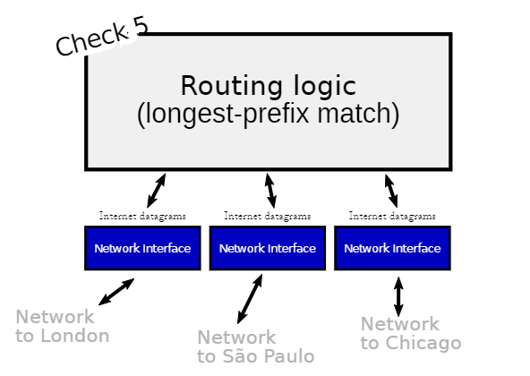
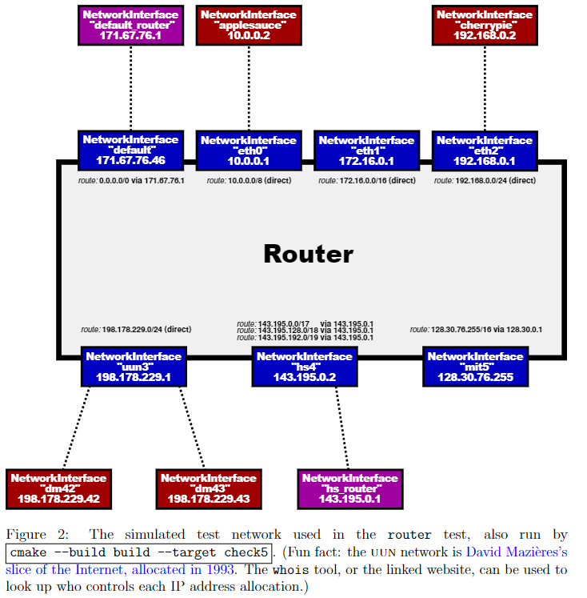

Checkpoint 5 Writeup
====================

# 回顾
在本周的实验检查点中，你将在现有的 NetworkInterface 基础上实现一个 IP 路由器。路由器有多个网络接口，可以在任何一个接口上接收 Internet 数据报。路由器的任务是根据路由表转发收到的数据报，路由表是一个规则列表，告诉路由器对于任何给定的数据报：

- 要通过哪个接口发送它
- 下一跳的IP地址

你的任务是实现一个路由器，可以为任何给定的数据报确定这两个信息。（你不需要实现生成路由表的算法，如 RIP、OSPF、BGP 或 SDN 控制器，只需实现按照路由表进行转发的算法。）

你的路由器实现将使用 Minnow 库，其中包含一个新的 Router 类，并使用模拟网络中的测试来检查你的路由器功能。检查点5基于你在 Checkpoint 4 中对NetworkInterface 的实现，但不使用之前实现的 TCP 栈。IP 路由器不需要了解 TCP、ARP 或以太网（只需要了解 IP）。我们预计你的实现大约需要 30 到 60 行代码。（从起始代码中，脚本/代码行数工具显示“Router: 61行代码”，我们的示例解决方案显示“109行代码”。）

# 准备开始


图1：一个路由器包含多个网络接口，可以在任何一个接口上接收 IP 数据报。路由器通过适当的出站接口，将接收到的任何数据报转发到下一个跳。路由表告诉路由器如何做出这个决策。

## Checkpoint 4 测试
```git
cmake -S . -B build
cd build/
cmake ..
make check4
```

## Checkpoint 5 获取

```git
git fetch --all
git merge origin/check5-startercode
cmake -S . -B build
cmake --build build
```

# 实现路由器
在这个实验中，你将实现一个Router类，它可以：

- 跟踪路由表（即转发规则或路径的列表）；
- 转发接收到的每个数据报
  - 到正确的下一跳
  - 正确的出站口 NetworkInterface。
  
你的实现将会添加到 router.hh 和 router.cc 的骨架文件中。在开始编码之前，请仔细阅读 router.hh 中关于新的 Router 类的文档。下面是你将实现的两个方法以及我们对每个方法的期望：

```cpp
void add_route(uint32_t route_prefix, uint8_t prefix_length,optional<Address> next_hop, size_t interface_num);
```
该方法将一条路由添加到路由表中。您需要在 Router 类中添加一个数据结构作为私有成员来存储此信息。该方法所需要做的就是保存路线以供以后使用。

What do the parts of a route mean?

一条路由规则是一个"匹配-动作"规则：它告诉路由器，如果一个数据报要前往特定的网络（一段 IP 地址范围），并且如果该路由规则被选为最具体的匹配规则，那么路由器应该将数据报转发到特定的下一跳和特定的接口。

"匹配"：这个数据报是否要前往这个网络？路由前缀和前缀长度一起指定了一个 IP 地址范围（一个网络），该范围可能包含数据报的目的地。路由前缀是一个 32 位的数字 IP 地址。前缀长度是一个介于 0 和 32（包含）之间的数字，它告诉路由器路由前缀的最高有效位有多少位。例如，要表示到网络"18.47.0.0/16"的路由（它匹配任何第一个两个字节是 18 和 47 的 32 位IP地址），路由前缀将是 305070080（$18×2^{24} + 47×2^{16}$），前缀长度将是 16。任何要前往 "18.47.x.y" 的数据报都会匹配。

"动作"：如果路由匹配并且被选择，要执行什么操作？如果路由器直接连接到相关的网络，下一跳将是一个空的可选项。在这种情况下，下一跳是数据报的目的地地址。但是，如果路由器通过其他路由器连接到相关网络，则下一跳将包含路径上下一个路由器的 IP 地址。接口编号给出了路由器的 NetworkInterface 的索引，用于将数据报发送到下一跳。你可以使用 interface(interface_num) 方法访问这个接口。


```cpp
void route();
```
这是关键的一步。该方法需要将每个接收到的数据报路由到下一跳，并通过适当的接口发送出去。它需要实现 IP 路由器的“最长前缀匹配”逻辑，以找到最佳的路由路径。
具体来说：

- 路由器会搜索路由表，找到与数据报的目的地址匹配的路由。所谓的匹配是指目的地址的最高有效位前缀长度与路由前缀的最高有效位前缀长度相等。
- 在匹配的路由中，路由器选择具有最大前缀长度值的路由。这就是最长前缀匹配路由。
- 如果没有匹配的路由，路由器将丢弃该数据报。
- 路由器会减少数据报的TTL（存活时间）。如果 TTL 已经为零，或者在减少后变为零，路由器应该丢弃该数据报。
- 否则，路由器将修改后的数据报通过适当的接口（interface(interface num).send datagram()）发送到适当的下一跳。


在互联网的设计中，有一种美感（或者至少是一个成功的抽象）：路由器从不考虑 TCP、ARP 或以太网帧。路由器甚至不知道链路层是什么样子。路由器只关心网络数据报，并且只通过 NetworkInterface 抽象与链路层进行交互。当涉及到诸如“链路层地址是如何解析的？”或者“链路层是否具有自己与IP不同的寻址方案？”或者“链路层帧的格式是什么？”或者“数据报的有效负载的含义是什么？”这样的问题时，路由器根本不关心。

# 测试
```
cmake --build build --target check5
```

